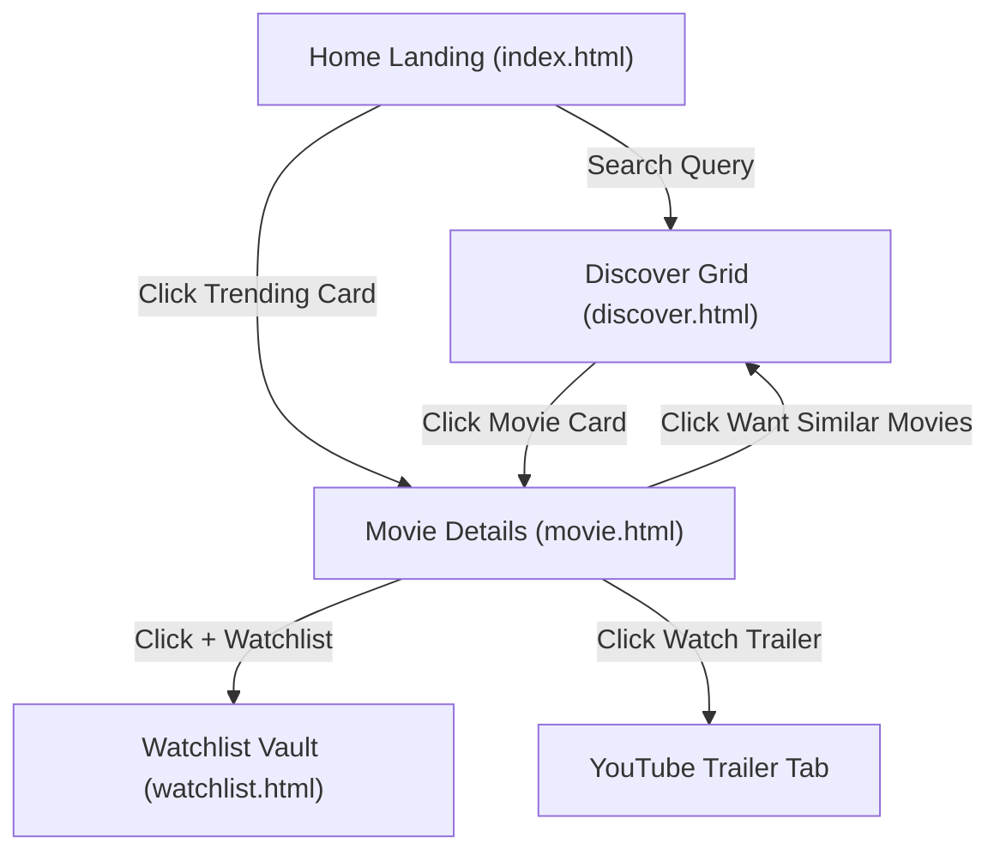

# VANTA System Architecture & ML Pipeline

VANTA is a hybrid cinematic recommendation engine designed to overcome the limitations of pure genre tagging or keyword matching by combining **dense semantic embeddings** with **weighted sparse TF-IDF metadata representations**.

---

## 🧠 Machine Learning & Data Science Architecture

### 1. Hybrid Embedding Model
The similarity score $S(A, B)$ between target film $A$ and candidate film $B$ is computed as a weighted combination of dense and sparse vector spaces:

$$S(A, B) = w_{\text{dense}} \cdot \cos(\mathbf{e}_A, \mathbf{e}_B) + w_{\text{sparse}} \cdot \cos(\mathbf{t}_A, \mathbf{t}_B)$$

Where:
- $\mathbf{e}_A, \mathbf{e}_B \in \mathbb{R}^{384}$: 384-dimensional dense semantic embeddings generated via `all-MiniLM-L6-v2` SentenceTransformers over plot summaries and thematic hooks ($w_{\text{dense}} = 0.50$).
- $\mathbf{t}_A, \mathbf{t}_B$: Weighted sparse TF-IDF vectors encoding directors, key cast, sub-genres, keywords, and release eras ($w_{\text{sparse}} = 0.50$).

### 2. Dataset Pipeline
1. **Raw Ingestion**: IMDB dataset combined with TMDB metadata API ($70,241$ movies).
2. **Preprocessing**: Cleaning title strings, handling missing values, extracting high-res TMDB poster/backdrop paths, cast, and directors.
3. **Vectorization**: Prefiltered matrix operations exported to `data/processed/movies_enriched.csv`.

---

## 🎨 Web Frontend & UI Architecture

### 1. Navigation Flow


### 2. Local Storage Vault
Saved films persist in client `localStorage` under the key `vanta_watchlist`:
```json
[
  {
    "title": "Inception",
    "year": 2010,
    "rating": 8.4,
    "genres": ["ACTION", "ADVENTURE", "SCI-FI"],
    "overview": "Cobb, a skilled thief...",
    "poster_url": "https://image.tmdb.org/t/p/w500/oYuLE1h2CVCdIFvDStmyTeLx9y1.jpg"
  }
]
```

### 3. Design Tokens & Nocturnal Aesthetics
- **Theme**: Dark Mode Nocturnal UI (`#121414` / `#0d0e12`).
- **Typography**: `DM Serif Display` (headers & cinematic quotes), `Geist` (ui labels & badges), `Inter` (body copy).
- **Accents**: Cyan/Indigo Glow (`#7cd0ff` / `#8792ff`).
